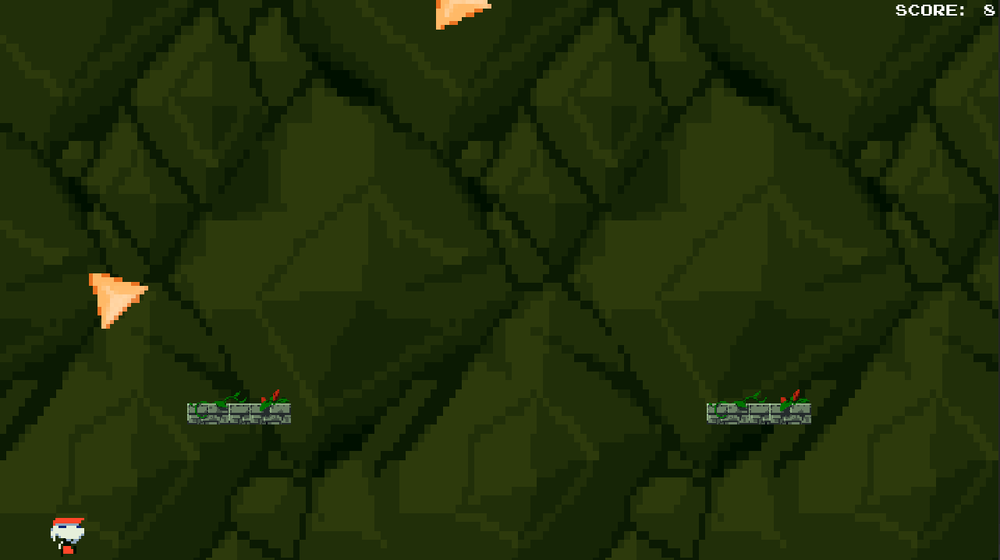
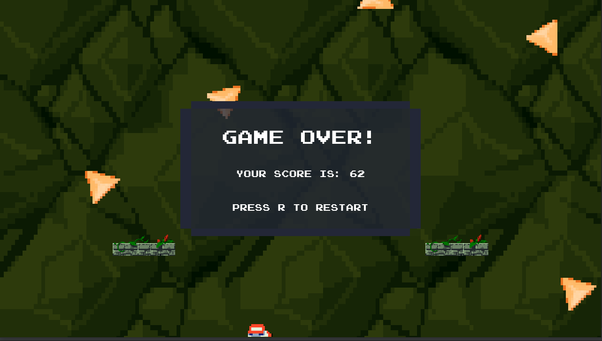

# Quake Miner

Quake miner is an infinite 2D survival game built on the Box2D physics engine. Debris constantly falls on you and you 
can earn points by destroying it by throwing a sword or having "near misses" with them (getting really close but not
touching it). The game is over when you are hit by debris.

## Dependencies

- [Microsoft Visual Studio 2015](https://visualstudio.microsoft.com/vs/older-downloads/)
- [Cmake](https://cmake.org/download/)
- [Cinder](https://libcinder.org/download)
- [Box2D "cinder block"](https://github.com/cinder/Cinder/tree/master/blocks/Box2D)

## General Installation
- Clone the cinder repo from its [GitHub repo](https://github.com/cinder/Cinder).
- Inside of `/Cinder/`, create a folder called`my-projects`.
- Clone the Quake Miner project into `/Cinder/my-projects/`.
- You can now build this project using Cmake

## Build Settings
This game is only meant to be played at a 16:9 aspect ratio (i.e. 1920x1080, 1280x720). It defaults to running at 720p
in windowed mode, however this may be changed by altering `kWidth` and `kHeight` in `/apps/my_app.h` of the project
directory. You may also change `kFullscreen` in `/apps/m_app.h` to change whether or not the game is fullscreen.

## Controls

### Main Menu
| Key          | Action          |
|--------------|-----------------|
| `LEFT MOUSE` | Start the game. |
| `ESC`        | Quit the game.  |

### In-Game
| Key          | Action         |
|--------------|----------------|
| `LEFT MOUSE` | Throw a sword in the direction of the mouse. |
| `ESC`        | Quit to the main menu.                       |
| `R`          | Restart the current run.                     |
| `A`          | Move left.                                   |
| `D`          | Move right.                                  |
| `SPACE`      | Jump (if grounded).                          |

### Game Over Screen
| Key   | Action                |
|-------|-----------------------|
| `R`   | Start a new run       |
| `ESC` | Quit to the main menu |

## Links
You can find a demo of this game on my [YouTube channel](https://www.youtube.com/watch?v=2asWgFl4VyI).

## Credits
- Most of the visual assets were taken from [Ehm's upload of the Cave Story assets](
https://www.spriters-resource.com/3ds/cavestory3d/sheet/66283/).
- The music is taken from the [Cave Story OST on YouTube](
https://www.spriters-resource.com/3ds/cavestory3d/sheet/66283/).
- The hit and near miss sounds are from LittleRobotSoundFactory's [8-Bit Sound Effects Library](
https://freesound.org/people/LittleRobotSoundFactory/packs/16681/).
- The throw sound is from Mike Koenig's [Spear Throw Sound](
http://soundbible.com/1622-Spear-Throw.html).
- The font is from Yuji Adachi's [ARCADE_N](https://www.dafont.com/arcade-ya.font) font.
- The title image was created by me.